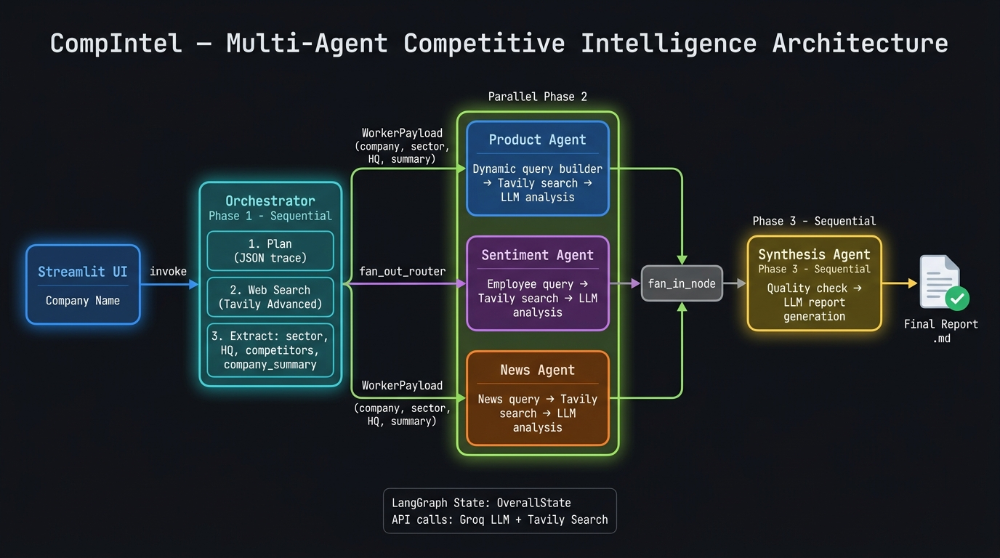

# CompIntel — Multi-Agent Competitive Intelligence System

> A production-grade, multi-agent AI pipeline that researches any company and produces a structured competitive intelligence brief in seconds.

🚀 **Live Demo:** [https://agentic-ai-7.streamlit.app/](https://agentic-ai-7.streamlit.app/)



---

## What It Does

CompIntel takes a company name as input and autonomously:
1. **Plans** a research strategy using an LLM
2. **Extracts** verified ground-truth context (sector, HQ, competitors, company summary) via web search
3. **Dispatches 3 parallel agents** — Product, Sentiment, and News — each running their own dynamic Tavily searches
4. **Synthesizes** all findings into a clean, structured Markdown report

Built with **LangGraph** (fan-out / fan-in topology), **Groq LLM**, and **Tavily Search API**.

---

## Tech Stack

| Component       | Technology                        |
|-----------------|-----------------------------------|
| Orchestration   | LangGraph `>=0.2.0`               |
| LLM             | Groq ('gpt-oss-120B') |
| Web Search      | Tavily Search API (Advanced mode) |
| Validation      | Pydantic `>=2.7.0`                |
| UI              | Streamlit                         |
| Runtime         | Python 3.11+                      |

---

## Setup

### 1. Clone the repository
```bash
git clone https://github.com/<your-username>/Agentic-AI.git
cd Agentic-AI
```

### 2. Create and activate a virtual environment
```bash
python -m venv venv

# Windows
venv\Scripts\activate

# macOS / Linux
source venv/bin/activate
```

### 3. Install dependencies
```bash
pip install -r requirements.txt
pip install streamlit  # UI dependency
```

### 4. Configure API keys

Create a `.env` file in the project root:
```env
GROQ_API_KEY=your_groq_api_key_here
TAVILY_API_KEY=your_tavily_api_key_here
```

Get your API keys from:
- **Groq:** https://console.groq.com/keys (free tier available)
- **Tavily:** https://app.tavily.com/home (free tier: 1,000 searches/month)

---

## Running the App

### Option A: Local Run (Recommended)
```bash
streamlit run app.py
```
Open your browser at `http://localhost:8501`.

### Option B: Deploy to Streamlit Cloud (Live URL)
You can easily host this app for free on Streamlit Community Cloud:

1. Push this repository to your GitHub account.
2. Go to [share.streamlit.io](https://share.streamlit.io/) and log in with GitHub.
3. Click **New app** and select your repository, branch, and `app.py` as the main file.
4. Click **Advanced settings** before deploying and add your API keys under **Secrets**:
   ```toml
   GROQ_API_KEY="your_groq_api_key_here"
   TAVILY_API_KEY="your_tavily_api_key_here"
   ```
5. Click **Deploy!** Your app will be live at a public URL (e.g., `https://your-app-name.streamlit.app`).

### CLI / Headless mode
```bash
python main.py
```

---

## Project Structure

```
Agentic-AI/
├── app.py                          # Streamlit UI entrypoint
├── main.py                         # CLI entrypoint
├── requirements.txt
├── .env                            # API keys (not committed)
│
├── competitive_intel/
│   ├── graph.py                    # LangGraph graph definition & fan-out router
│   ├── state.py                    # OverallState + WorkerPayload TypedDicts
│   ├── llm.py                      # Groq LLM wrapper
│   ├── tools.py                    # Tavily search wrapper + Pydantic validator
│   ├── ui_callback.py              # Thread-safe event emitter for live UI updates
│   │
│   └── agents/
│       ├── orchestrator.py         # Phase 1: Plan → Search → Extract ground truth
│       ├── worker_base.py          # Shared worker logic (search + LLM + quality checks)
│       ├── product_agent.py        # Parallel: Product & technology analysis
│       ├── reputation_agent.py     # Parallel: Employee & workplace sentiment
│       ├── news_agent.py           # Parallel: News & strategic momentum
│       └── synthesis_agent.py      # Phase 3: Final report generation
│
└── docs/
    └── architecture_diagram.jpg
```

---

## How It Works

### Graph Topology (LangGraph)
```
orchestrator_node
       │
       ▼ fan_out_router (Send API — runs 3 agents in parallel)
  ┌────┴────┬──────────┐
  ▼         ▼          ▼
product   reputation  news
_worker   _worker     _worker
  └────┬────┴──────────┘
       ▼ fan_in_node
  synthesis_node
```

### Key Design Decisions
- **Ground-truth baseline first**: The Orchestrator anchors all downstream work to real web-search data, preventing LLM hallucination of the company's sector.
- **Deterministic quality checks**: Worker confidence is measured by result count and character volume, not LLM scoring.
- **Dynamic short queries**: Each agent generates a 3-4 word, sector-aware Tavily query using the verified `company_summary`.
- **Fan-out / fan-in**: All 3 parallel agents run concurrently, reducing total latency vs. sequential execution.

---

## Sample Output

See [`docs/sample_transcripts.md`](docs/sample_transcripts.md) for 3 full run examples including planning traces and final reports.
